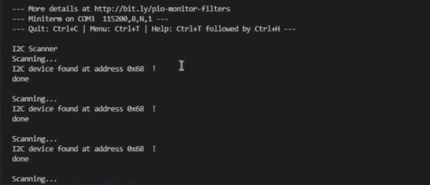

# PRACTICA 5: BUSES DE COMUNICACIÓN I

## INFORME PARTE A

### Salida por el puerto serie

A continuación podemos ver el resultado de la salida por el puerto serie:

<!--Images-->

### Funcionamiento

Primeramente el codigo espera al serial monitor, una vez se ha iniciado, muestra por pantalla el mensaje I2C Scanner como podemos ver en la imagen del apartado anterior. 

Seguidamente se entra en un bucle, y se empieza a escanear. Dentro del bucle se recorren las direcciones de la 1 a la 126 y se empieza a transmitir por el cable de datos. Si todo funciona correctamente para cada dirección individualmente se muestra el mensaje "I2C device found at adress..." con la direccion que se ha encontrado en formato hexadecimal. 
Si por algun motivo al transmisión se corta en alguna dirección, es decir si hay un error, el programa mostrara el mensaje "Unknown error at adress..." en la dirección que haya tenido problemas.

Por ultimo si no se ha podido transmitir por ninguna dirección significa que la dirección no se ha encontrado por lo que mostraria el mensaje "No I2C devices found".